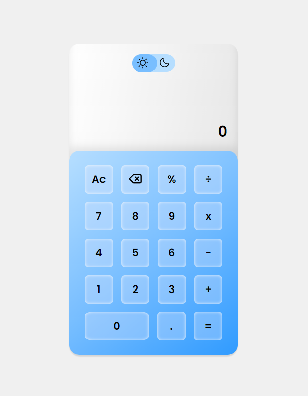
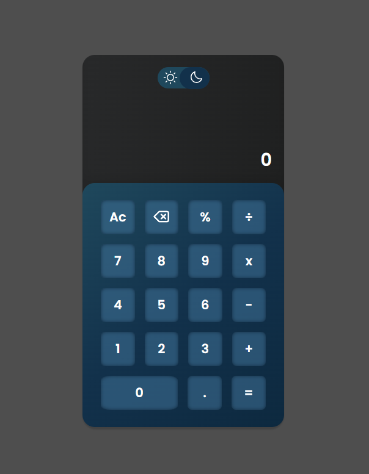

# Calculadora 📱

Projeto de uma calculadora de operações simples usando apenas HTML, CSS e JavaScript.

🌐 ACESSE O PROJETO HOSPEDADO [CLICANDO AQUI](https://gabrielbuttendorf.github.io/projetos/calculadora/){:target="_blank"}

## Funcionalidades

- Calcular operações básicas
- Trocar tema (Claro e Escuro)

## Imagens do Projeto

    
    

### Tecnologia Utilizadas

    
    
    

### Redes Sociais 👨🏻‍💼

- [Linkedin](https://www.linkedin.com/in/gabrielbuttendorf/){:target="_blank"}
- [Instagram](https://www.instagram.com/bieel.felipe_/){:target="_blank"}
- [GitHub](https://github.com/gabrielbuttendorf){:target="_blank"}
